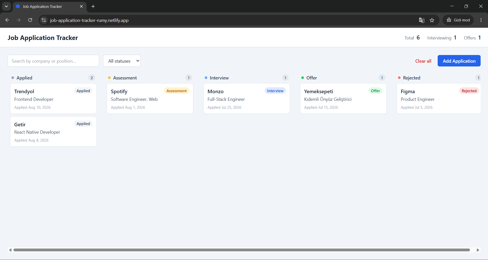
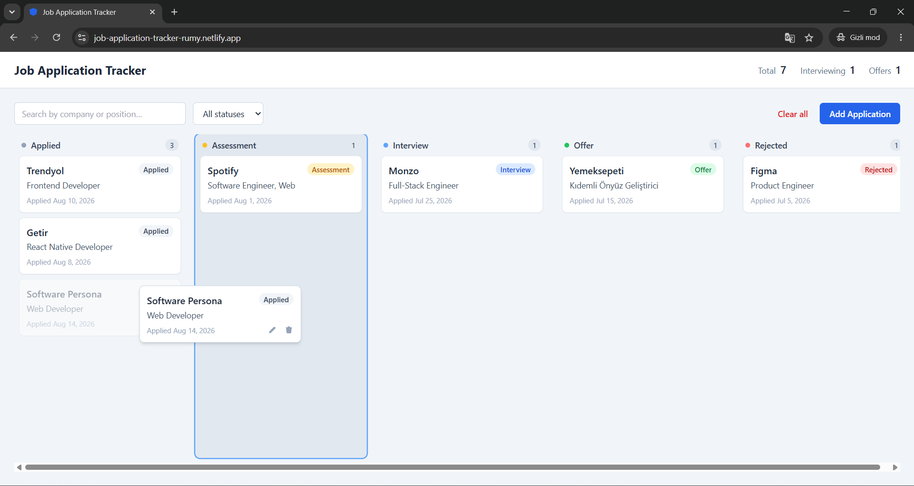
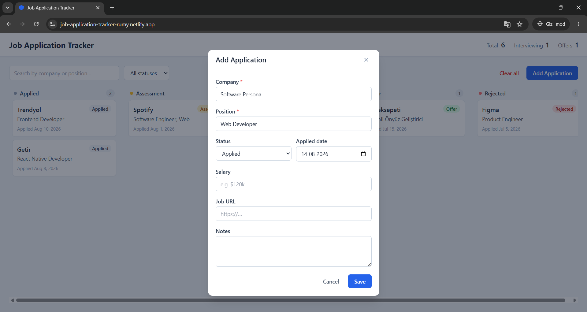
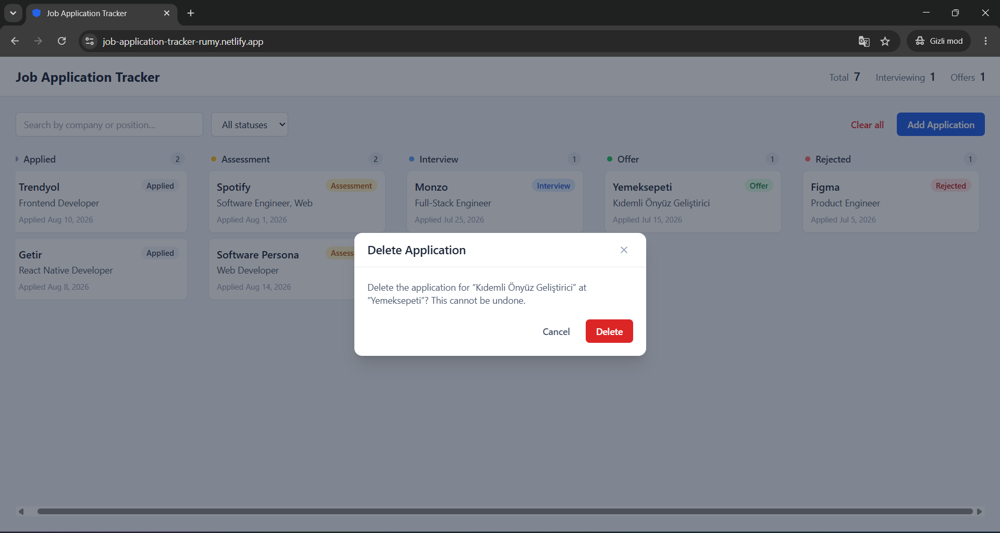
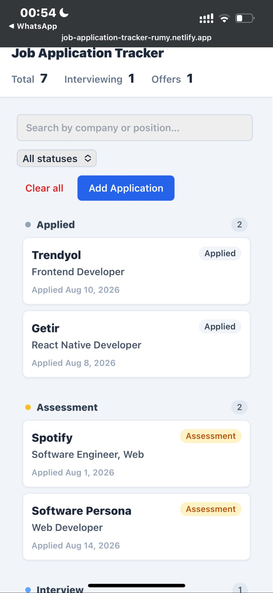

# Job Application Tracker

A kanban-style web app for tracking job applications across their lifecycle.

**Live demo:** https://job-application-tracker-rumy.netlify.app/



Job Application Tracker gives you a single board to keep every job application in
one place and see its progress at a glance — from the moment you apply through to
an offer or a rejection. Drag cards between columns as things move forward, search
and filter to find a specific role, and rely on automatic local persistence so
your data is there when you come back. It's built for job seekers who want a fast,
private way to stay organized, with no account or backend required.

## Features

- Full CRUD for job applications (create, read, update, delete)
- Kanban board with five status columns: Applied → Assessment → Interview → Offer → Rejected
- Drag-and-drop cards between columns to change status (with keyboard support via @dnd-kit)
- Delete with a confirmation step
- Search by company or position, and filter by status
- Summary counters (total, interviewing, offers)
- Data persisted in the browser via LocalStorage
- Responsive layout (columns stack vertically on mobile)
- Optional one-click sample data to explore the app

## Tech Stack

- **React** — UI library
- **Vite** — build tooling and dev server
- **Tailwind CSS** — styling
- **@dnd-kit** — drag-and-drop (with keyboard support)
- **LocalStorage** — client-side persistence (no backend)

## Screenshots



_Moving a card between columns_



_Adding / editing an application_



_Delete with confirmation_



_Responsive mobile layout_

## Getting Started

### Prerequisites

- Node.js (v18+ recommended)

### Steps

Clone the repository:

```bash
git clone https://github.com/zeyneppkaa/job-application-tracker.git
cd job-application-tracker
```

Install dependencies:

```bash
npm install
```

Start the development server:

```bash
npm run dev
```

Build for production (output to `dist/`):

```bash
npm run build
```

## Project Structure

```
src/
  components/   UI components (Board, Column, cards, modal, form, controls)
  pages/        Top-level page (HomePage) that owns app state
  interfaces/   Data model and status definitions
  hooks/        useApplications — CRUD + LocalStorage persistence
  utils/        Storage, date formatting, status colors, sample data
```

## Notes

- All data is stored locally in your browser only — there is no account and no backend.
- Use **Clear all** to reset the board and remove every application.
- When the board is empty, you can load **sample data** with one click to explore the app.
